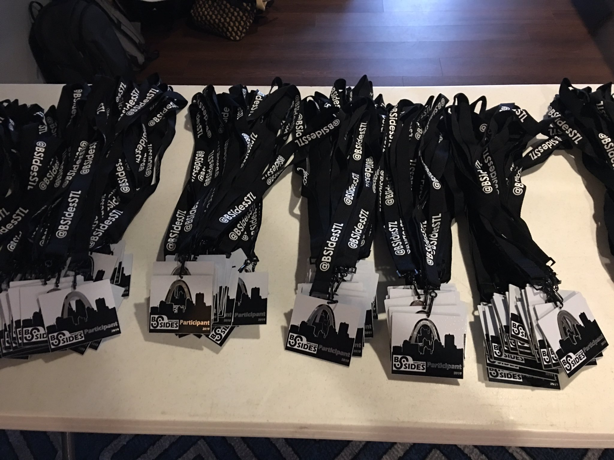

*Courtesy of BSides STL - @bsidesSTL*

Woo! First time going to a BSides conference was a success. Other than the coffee...*Oh the coffee*...

I got to spend a ton of time getting to know some of the people working in InfoSec in the area. The talks were great so good work to everyone who gave a talk!

*Sorry if I missed your Twitter handle! Let me know and I'll add it.*

> Josh Rickard - @MSAdministrator 
> Frank Angiolelli - @FrankAngiletuno 
> Beth Young - @bethayoung 
> Eric Lee - @ericblee6 
> "The Infosec Goat" - @ar4v3n 
> Michael Collins - @h3mlock 

*For a complete list of the talks visit the [schedule](https://bsidesstl2019.busyconf.com/schedule#activity_5d13959bcd08ded7e20000f5).*

 One of my favorite talks given was *Hacking is Dead, Long Live Hacking* by Michael Collins. It was interesting to hear from someone I would consider a veteran in InfoSec talk about their journey through the world of InfoSec. Their talk covered the changing landscape of Hacking over the years and how automation, new technology, etc. has made it more difficult than it once was but at the same time has not killed hacking all together. Michael gave one of my favorite demos on *Wardialing* that would have made even David, *Matthew Broderick*, proud. You can see information on the talk [here](https://bsidesstl2019.busyconf.com/activities/5d13959bcd08ded7e20000f5).

 

 Overall, it was an incredible first experience and I cannot wait until next year! You can follow [@bsidesSTL](https://twitter.com/bsidesSTL) for more information and videos from the conference. Let them know I sent you!

 *Hack the planet!*
