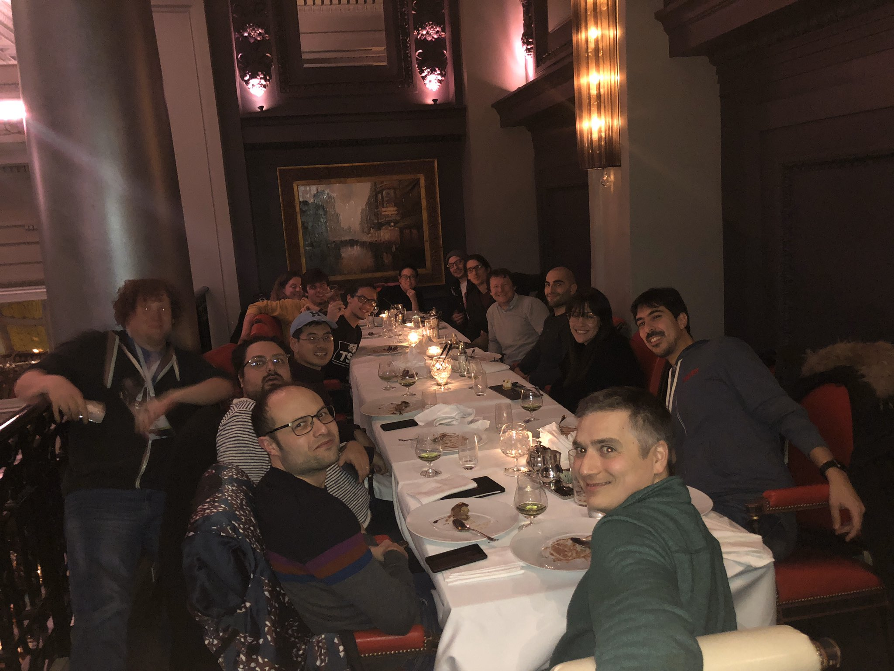

## The Trip

Woo! The day I have waited for for months now is finally here! I started out the trip getting into Montréal the night before at around 10 p.m. It was a long trip and I was more than ready to turn in for the night (The hotel is nice though!). 

## Day #1

Good morning Montréal! Even though I didn't sleep much the night before, I was more than ready to get the day started. Being tired isn't something coffee can't help anyways. Anyways, off to the convention center! 

Montréal is wicked cold this time of year. I would say it reminds me a lot of Chicago winter weather which is cold beyond belief and _super_ windy. With only a ten to fifteen minute walk I can't complain much.

The first day at the conference opens with a gathering in the lobby outside of where the opening keynote would take place. I met Nick Nisi who is one of the hosts of JS Party, a podcast about everything JavaScript (you can follow them here [@JSPartyFM](https://twitter.com/JSPartyFM)). 

_It's time for the keynote!_

The keynote opens with a message from Robin Bender Ginn who is the executive director of the OpenJS foundation. During the opening talk we were given updates of the state of JavaScript and community updates. This showed that JavaScript if the top language on RedMonk and the most popular language on GitHub by repository contributors! Other noteworthy news included the introduction of a Node.js certification program and welcoming Electron into the OpenJSFoundation! 🎉 Other keynotes included _The Future of JavaScript is Universal_, a detailed overview of the Node.js certification program, making your opensource project foundation ready, and (possibly my favorite keynote of the morning) Ellie Galloway's Jewelbots demo!

_On to the talks!_

After the keynote it's time for some talks! I tried to make it to as many talks as possible. This included everything from making the most of your experience with Node.js to implementing Kubernetes into your application. 

One of the best parts of conferences are the networking opportunities. Throughout the day there were a variety breaks that allowed attendees to meet with company representatives as well as fellow developers. Node+JS interactive does not disappoint with these opportunities. Wether it was the many coffee breaks (of which I was a fan of) or a trip to Tim Horton's for some Timbits.

Day one is over! time to get some rest and get ready for the final day of the conference. 

## Day #2

Day two opens very similar to the first day but we go straight into the talks after a quick breakfast.

More talks today include an introduction into libuv and the future of Express. I was able to meet Wes Todd who is one of the maintainers of Express and discuss in greater depth the future of Express. I was able to make another great connection and an opportunity to be added to the GitHub group for Express and httpjs in a triage role! This is something I am super excited for as it will help me become more involved in opensource software contributing!

The day ends with the closing keynote talks and wrap up. It's the end of the conference but not the end of the festivities!

The night ended with a great dinner with friends from npm, Google, Netflix, and Heroku. Thank you Netflix for the great dinner and opportunity to meet and socialize with some awesome people. I look forward to Austin in a few months and I will see you all there!

## In Closing 

I feel extremely blessed to be a part of such a great community with amazing people. There wasn't a moment that I didn't feel out of place or like I didn't belong there. I wish there were more communities like this. Ones that foster community, bettering yourself as well as others, and learning something new. It was awesome to have such a great opportunity and I look forward to seeing everyone again. ❤️ Thanks and great work to everyone that made such a great conference happen! 

> To see the schedule and the confrence site, please go [here](https://events19.linuxfoundation.org/events/nodejs-interactive-2019/program/schedule/)

