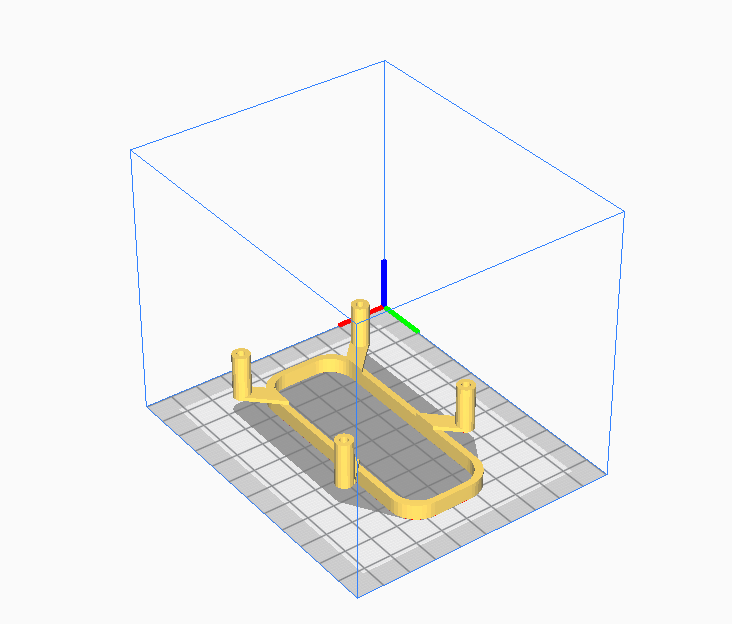
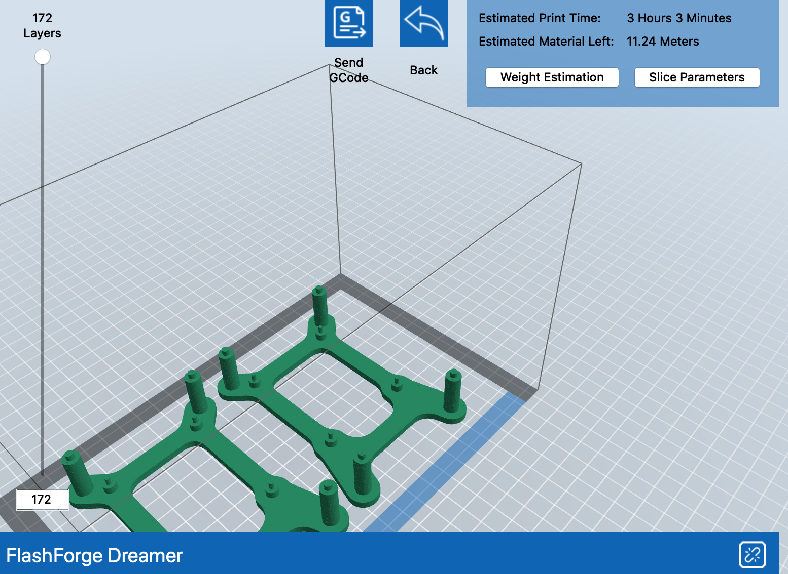

### Preface

With COVID-19 being a thing, I have had to get creative in finding ways to keep my mind busy. I have picked up a couple projects since the start of all of this starting with reconfiguring my FreeNAS setup to various soldering projects. I stumbled upon a video on YouTube where someone used Raspbery Pi compute modules to create a cluster computer to run Kubernetes. I figured that would be the next project I take up but to instead do the same with Raspberry Pi 4 Bs. This is the first part in the journey and we will see where this goes!

### Goals

First thing's first. Where do I want to go with this? I want to create a setup that has six individual Pis. This would end up being one main node and then five compute nodes if I am understanding what I need to do for this correctly (I too am learning as I do this). Newer Pi 4 Bs _should_ be powerable through power over ethernet (PoE). This is nice since this means that I won't have to fiddle with consuming six outlets to power this when I only need one for the switch itself. Lastly, running Kubernetes on this setup. Typical Kubernetes installs are pretty hefty and may not support the typical ARM architecture. However, there are lighter Kubernetes flavors that _should_ have the support I need to be able to run this.  A possible candidate is k3s from Rancher which can be found [here](https://www.k3s.io). I think this with a dash of Ansible will be exactly what I will need for this to work the way I would like it to.

### Part 1

Finally, the fun stuff. First, how am I going to organize this? The easiest answer is to not organize it and have it be a mess of cables on my desk. However, I am lucky and I have a 3D printer!  Well I have more than one which will make this process a whole lot fast. None the less, this is not a necessary step to follow since most who read this may not access to a 3D printer. If you would like, I would be more than happy to print out these parts for you if you reach out to me. 

Before we get started, I need to find a suitable enclosure for this. I used the files mentioned below to build an enclosure that would fit my needs for this project. 

> 6x Pi Mounts (http://tiny.cc/2faxqz)  
> 1x Mount Top (http://tiny.cc/thaxqz)  
> 5x Pi Hold-Down (http://tiny.cc/2laxqz)  
> 1x Pi Hold-Down Top (http://tiny.cc/cmaxqz)  

Let's get to printing! I used Cura/Flashprint to do the slicing for the different parts that I needed to print. You can use whichever slicing software you choose to use for slicing. 

 

Let's load it up on the printer and get to printing! I could only do two of these at a time at rough three and a half hours for each set so roughly ten and a half hours for all six needed just for the mounts. This will take some time to print all of the parts. 

Once all is said and done, you should be able to put these parts together and have a sort of tower for your Pis to keep them organized. I printed the mounts in a different color from the hold-downs since this is something that is going to be sitting on my desk and I wanted something a little more colorful to look at. 

That's it for part one! I am looking to start the second part of this next month and writed about it shortly after. Stay tuned!